# DealSpine — The Complete Guide

*A step-by-step book for every role: how to price, govern, prove, and learn from AI‑enabled SAP delivery in one workspace.*

> **About this edition.** This guide covers the English (US) interface of the DealSpine pilot. Every screenshot is captured from the running application. Japanese screens and their translation are a later edition. AI insights are illustrated with **Claude**; the sample insight text in this book is authored to show what a live Claude response looks like — the pilot ships with an offline deterministic analysis that runs when no API key is configured.

---

## Table of contents

- **Part 0 — Orientation**
  - What DealSpine is
  - The closed loop: Prepare → Track → Learn
  - The people: five roles and a builder
  - Signing in
  - The workspace at a glance
- **Part 1 — The case example** (the spine of this book)
- **Part 2 — Role walkthroughs**
  - Chapter 1 · Priya, the Pricing Owner — Policy Studio
  - Chapter 2 · Sam, Sales / Advisory — the Deal Workspace
  - Chapter 3 · Sam — generating the customer proposal
  - Chapter 4 · Dana, the Deal Desk — approvals and governance
  - Chapter 5 · Devi, Delivery / PMO — evidence and sold‑vs‑actual
  - Chapter 6 · Lee, Leadership — the portfolio
  - Chapter 7 · Bea, the Builder — AI insights and Insight Studio
- **Part 3 — AI insights with Claude** (deep dive, with sample insights)
- **Part 4 — Reference**
  - Who can see and do what (access matrix)
  - The engine, in numbers
  - Glossary
  - Settings and Help
- **Appendix — What comes next**

---

# Part 0 — Orientation

## What DealSpine is

DealSpine is an internal platform for an SAP advisory practice. It replaces three loose artifacts — a pricing deck, a spreadsheet calculator, and an evidence log — with one workspace that does three jobs:

1. **Prepare** a governed commercial proposal for a deal.
2. **Track** what was actually delivered against what was sold.
3. **Learn** from that history so the next proposal is sharper.

The heart of it is a pricing **engine** that turns a countable unit of work (a remediated object, an automated test case) into a defensible fixed price — and a set of **governance gates** that stop a quote from leaving the building if it falls below the floor. The deck sets the policy; DealSpine enforces it on every deal; the evidence log keeps both honest.

## The closed loop: Prepare → Track → Learn

- **Prepare.** Sales builds a quote in the Deal Workspace, the engine prices it and runs 34 policy gates, and — only if the quote clears governance or an approved exception exists — a customer‑safe proposal is generated.
- **Track.** Delivery logs one record per unit of work; the platform compares sold assumptions to delivered actuals.
- **Learn.** Measured coverage, effort, rework and token numbers feed back into the parameters the next quote uses, and accumulated best practice becomes reusable.

## The people: five roles and a builder

DealSpine has exactly five roles, plus a "builder" flag that any user can be granted. Everything a person sees or can do is governed by their role.

| Role | Who | Primary screens |
|---|---|---|
| **Pricing Owner** (admin) | Priya Owens | Policy Studio, Settings |
| **Sales / Advisory** | Sam Alvarez | Deal Workspace, Proposal, Insights |
| **Deal Desk** | Dana Kimura | Approvals |
| **Delivery / PMO** | Devi Larsson | Evidence, Engagements |
| **Leadership** | Lee Novak | Portfolio |
| **Builder** (a flag on any role) | Bea Tanaka (Sales + builder) | Insight Studio |

We will follow these six people through one real deal.

## Signing in

The pilot uses a simple picker — pick a seeded user to sign in. (In production this is replaced by single sign‑on.) The sign‑in card floats as a glass panel over the brand backdrop; the language switch (EN / 日本語) sits top‑right.

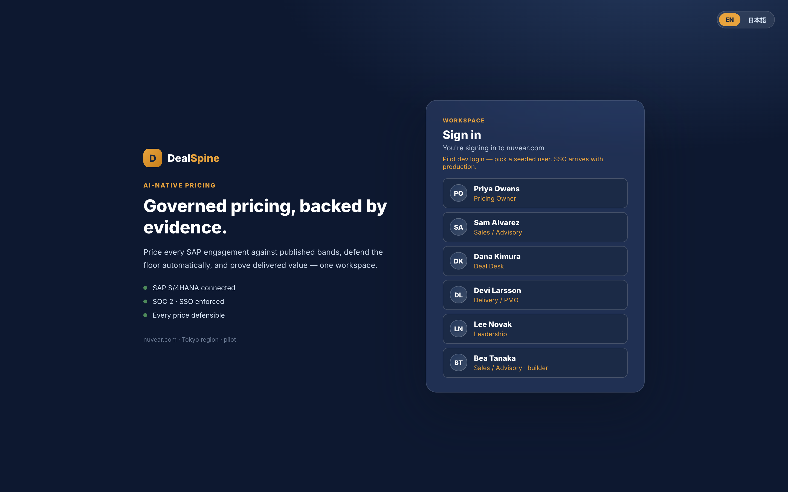

## The workspace at a glance

After signing in you land on a **role‑aware Home**. The dark left rail is the navigation; the controls at its foot switch **theme** (Light / Dark) and **glass intensity** (Full / Reduced / Opaque — DealSpine follows Apple's Liquid Glass design, where translucent "glass" is used only for navigation chrome and never for the numbers, which always sit on solid surfaces). The header carries search, the language switch, and your name and role.

Here is Home as **Dana**, the Deal Desk lead — her hub leads with the approval queue, because that is her job.

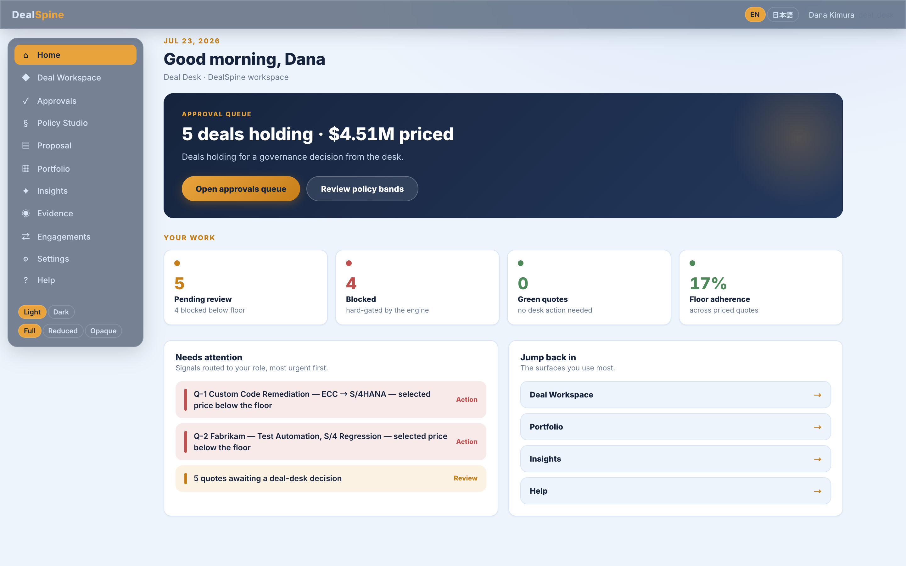

Home for **Lee** in Leadership leads instead with portfolio health — floor adherence, gross profit versus traditional, and reinvestment.

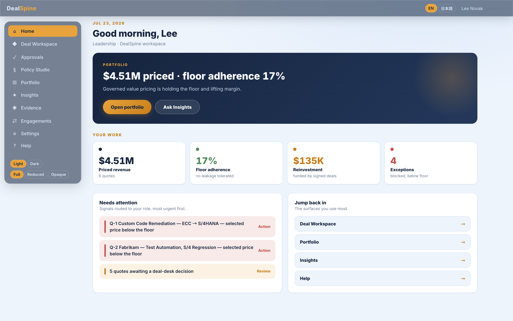

The same application, arranged around what each role needs first. That is the theme of this book.

---

# Part 1 — The case example

Throughout this guide we price one real engagement — the same worked example the framework deck builds in its *Case Example* slides:

> **Custom Code Remediation — ECC → S/4HANA.** A mid‑size ECC estate holds **12,000 custom ABAP objects**. An ATC readiness scan finds **30% need remediation** — so the unit count in scope is **U = 3,600 objects**. Traditionally each object takes **h = 3.5 hours**, billed at **Rb = $95/hour** against a loaded delivery cost of **Rc = $62/hour**.

From those five numbers everything else follows. The deck develops it in four steps (its slides 11–14); DealSpine reproduces every number live and then does something the deck cannot — it applies the full **risk‑adjusted** stack and **governs** the result.

| | Traditional (no AI) | AI + per‑unit value price |
|---|---:|---:|
| Customer price | **$1.20M** | **$897.75K** |
| Cost of delivery | $781.2K | $619.47K *(risk‑adjusted)* |
| Gross profit | $415.8K | $278.28K |
| Gross margin | 34.7% | 31.0% |
| Price / object | $333 | $249 |
| Revenue / delivery hour | $95 | **$153** |

The two most important lines in this book are the last two: DealSpine keeps the customer's price visibly lower **and** lifts revenue per delivery hour from $95 to $153 — while the governance engine refuses to let a rep give the saving away. Let's watch it happen, role by role.

---

# Part 2 — Role walkthroughs

## Chapter 1 · Priya, the Pricing Owner — Policy Studio

**Priya owns the rules.** Before any deal is priced, she defines the *offerings* (named services with a unit of work), their *rate cards*, and the *policy* — opening discount bands, minimum margins, and the floor logic. Bands, floors and margins are **read‑only for every other role**; only Priya can change and publish them.

She opens **Policy Studio**. The **Offerings** tab lists the five governed offerings with their opening band and rates, each versioned with a freshness indicator. A **Quarterly Reprice Clock** in the corner warns when any parameter set has gone stale (past 90 days since publish).

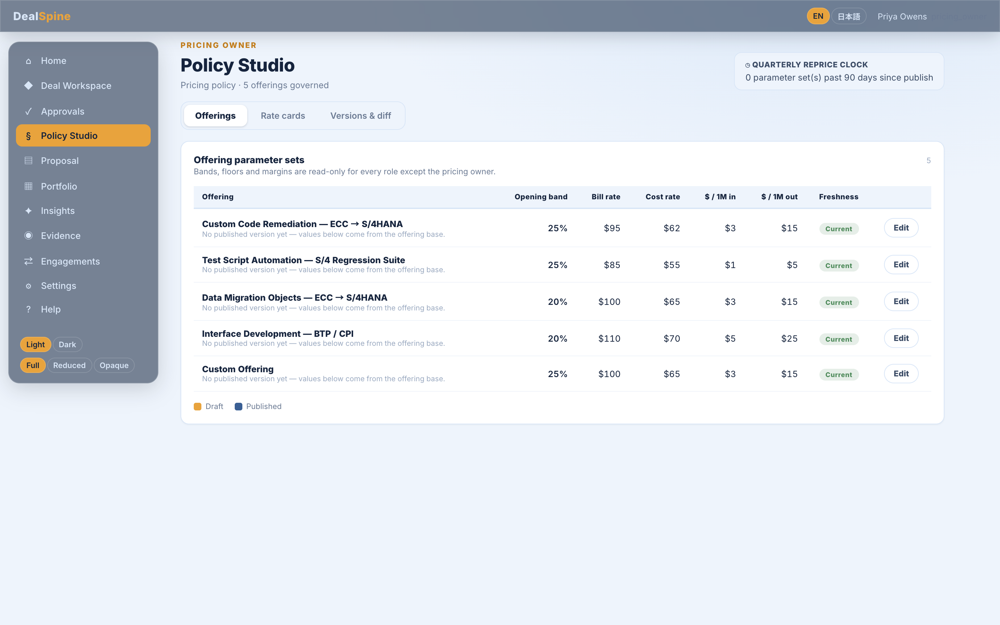

**Step by step, as Priya:**

1. Open **Policy Studio → Offerings**. Confirm *Custom Code Remediation — ECC → S/4HANA* carries the opening band and rate card the practice has agreed.
2. To change a value, click **Edit**, adjust the draft, and review the **Versions & diff** tab — every change is a new version with an effective date and an owner; a published version is immutable, so corrections create the next version rather than overwriting history.
3. Click **Publish**. From that moment, every new quote references the published parameter set. Sales sees these numbers, but cannot edit them.

> **Why it matters.** This is the "published band, confidential floor" discipline made literal: the opening band is visible policy; the true floor is computed per deal by the engine and never printed on a customer surface.

## Chapter 2 · Sam, Sales / Advisory — the Deal Workspace

**Sam prices the deal.** He opens the **Deal Workspace** and selects the *Custom Code Remediation* offering. The workspace has three columns: **inputs** on the left, **results** in the middle, and the **governance verdict** on the right. Every slider recomputes instantly — the engine runs live in the browser — and the same engine re‑runs on the server when he saves, so the stored number is always the authoritative one.

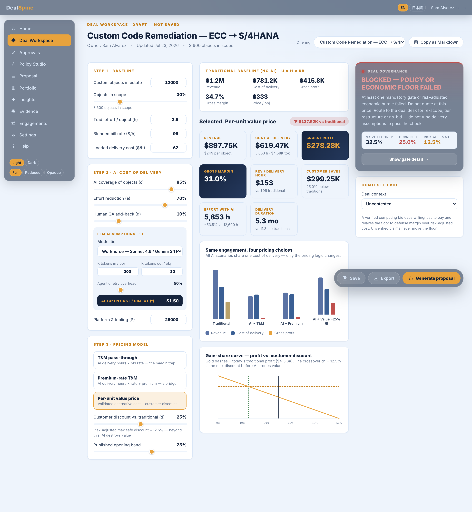

### Step 1 — Baseline (deck slide 11)

Sam enters the countable baseline in **Step 1**:

- Custom objects in estate: **12,000**
- Objects in scope: **30%** → the workspace shows **U = 3,600 objects**
- Traditional effort per object: **3.5 h**
- Blended bill rate: **$95/h** · Loaded delivery cost: **$62/h**

The **Traditional baseline** card computes the "no‑AI" world immediately:

> Revenue **$1.2M** · Cost of delivery **$781.2K** · Gross profit **$415.8K** · Gross margin **34.7%** · Price / object **$333**.

This is the number to protect — the deck calls the $415.8K gross profit "the number the whole framework exists to protect."

### Step 2 — AI cost of delivery (deck slide 12)

In **Step 2** Sam enters the measured AI parameters:

- AI coverage **c = 85%** · Effort reduction **e = 70%** · Human QA add‑back **q = 10%**
- LLM tier **Workhorse**, 200K input / 30K output tokens per object, 50% agentic‑retry overhead → **AI token cost ≈ $1.50 per object**
- Platform & tooling **P = $25,000**

The engine shows **Effort with AI = 5,853 hours** — a 53.5% cut from the traditional 12,600 — and an expected **delivery duration of 5.3 months** versus 11.3 traditionally. (The deck's "base AI cost" for this step is ~$392K; DealSpine goes further and carries the full risk‑adjusted cost of delivery, **$619.47K**, into governance — more on that below.)

### Steps 3–4 — Pricing model and value sharing (deck slides 13–14)

In **Step 3** Sam picks the pricing model. Four choices are compared in the *Same engagement, four pricing choices* chart — Traditional, AI + T&M, AI + Premium, and **AI + per‑unit value price**. He selects **Per‑unit value price** and sets the customer discount:

- Customer discount vs. traditional **d = 25%**
- Published opening band **25%**

The results update:

> Revenue **$897.75K** ($249 / object) · Gross profit **$278.28K** · Gross margin **31.0%** · **Revenue / delivery hour $153** (vs. $95 traditional) · **Customer saves $299.25K** (25% below traditional).

The **gain‑share curve** plots profit against discount. The gold dashed line is today's traditional profit ($415.8K); the vertical crossover marks the **risk‑adjusted maximum safe discount of 12.5%** — beyond that, DealSpine says, "AI destroys value."

### The governance verdict

Here is where DealSpine differs from a spreadsheet. The right‑hand **Deal Governance** panel reads:

> **BLOCKED — POLICY OR ECONOMIC FLOOR FAILED.** At least one mandatory gate or risk‑adjusted economic hurdle failed. Do not quote at this price. Route to the deal desk for re‑scope, tier restructure or no‑bid — do not tune delivery assumptions to pass the check.

with three numbers beneath it: **Naive floor d\* 32.5% · Current d 25.0% · Risk‑adjusted max 12.5%.**

This is the whole point. The deck's naive story says a 25% discount is "safely inside the 32.5% floor." DealSpine applies the real risk stack — rework reserve, warranty reserve, evidence uncertainty, commercial costs — and the honest floor is **12.5%**. A 25% discount is *past* it. So the quote is **blocked** and routed to the deal desk. A rep cannot simply sign it.

Sam clicks **Show gate detail** to see exactly which of the 34 gates failed and why.

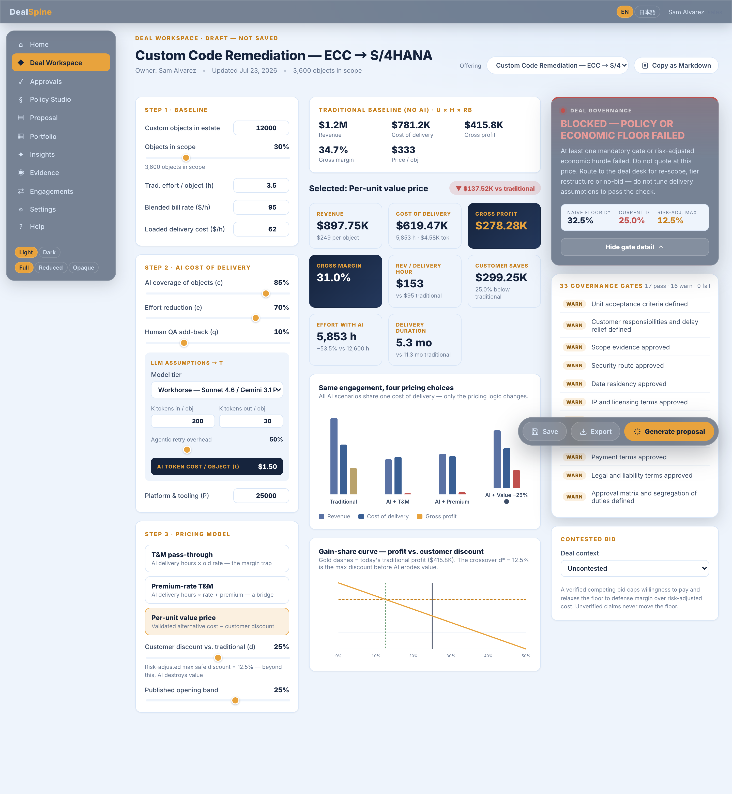

**Step by step, as Sam:**

1. Select the offering, enter the Step 1 baseline, confirm U = 3,600.
2. Enter the Step 2 AI parameters; read effort and duration.
3. Choose **Per‑unit value price**, set the discount, read the value results and the gain‑share curve.
4. Read the governance verdict. If green, generate the proposal. If **blocked** or **deal‑desk**, click **Show gate detail**, then **Save** the quote — saving a non‑green quote automatically opens an approval for the deal desk.
5. Use **Copy as Markdown** any time to drop the whole quote (baseline, economics, gates, verdict) into an email or an AI prompt.

## Chapter 3 · Sam — generating the customer proposal

A proposal can only be generated from a quote that has cleared governance (green) or carries an approved exception. Once the deal desk approves (Chapter 4), Sam opens **Proposal**.

The proposal is a **customer‑facing paper document** — and it is *structurally incapable* of showing an internal figure. There is no cost, no margin, no floor, no token math anywhere on it, because the renderer is built from a whitelist that simply has no such fields. A CI test fails the build if any internal figure ever leaks onto a customer surface; the green **"Internal figures excluded"** badge states the guarantee.

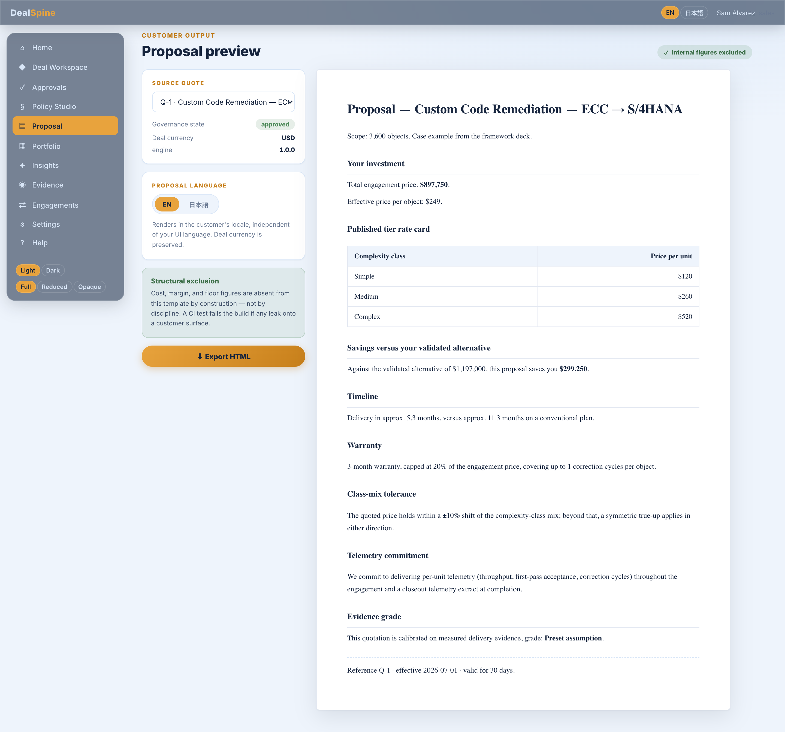

What the customer sees:

- **Your investment** — the total engagement price and the effective price per object.
- **Published tier rate card** — Simple **$120**, Medium **$260**, Complex **$520**. (Tiered prices are easier to defend in procurement than one blended number.)
- **Savings versus your validated alternative** — computed against the customer's evidenced alternative, not our rate card.
- **Timeline** — ~5.3 months versus ~11.3 on a conventional plan.
- **Warranty** — a 3‑month warranty, capped at 20% of fees, with defined correction cycles.
- **Class‑mix tolerance** — the quoted price holds within a ±10% shift of the complexity mix, with a symmetric true‑up either way.
- **Telemetry commitment** and **evidence grade** — the audit trail behind the price.

**Language and currency.** The **Proposal language** toggle (EN / 日本語) renders the document in the *customer's* locale, independent of Sam's UI language, while the **deal currency** is preserved. (A Japanese customer receives a Japanese proposal; a USD deal still shows USD.) Sam clicks **Export HTML** to send it.

## Chapter 4 · Dana, the Deal Desk — approvals and governance

**Dana holds the floor.** When Sam saved the blocked quote, an approval appeared in Dana's queue. She opens **Approvals**.

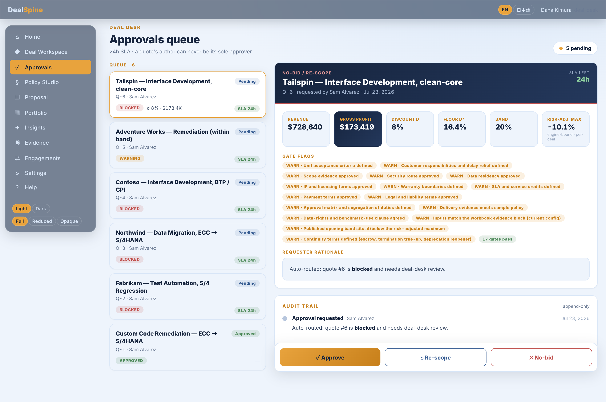

The queue shows each holding deal with quantified context — governance state, the discount, gross profit, and an SLA countdown. Selecting one opens a detail panel with the metric grid (Revenue, GP, discount, **naive floor d\***, band, and the **risk‑adjusted max**, annotated *engine‑bound · per‑deal* so no one mistakes it for a fixed policy value), the failing gate flags, and the requester's rationale.

Dana has exactly three sanctioned actions, each requiring a written rationale:

- **Approve** — record an exception (with an expiry). The deal may proceed; the rationale and approver are stored forever.
- **Re‑scope** — send it back to reduce risk or restructure the tiers.
- **No‑bid** — walk away when the customer's willingness to pay is below the floor.

Two rules are enforced by the platform and cannot be bypassed: **a quote's author can never approve their own quote**, and **every decision is appended to an immutable audit trail** (the events log rejects updates and deletes at the database level).

**Step by step, as Dana:**

1. Open **Approvals**, pick the holding quote.
2. Read the metric grid and the failing gates; read Sam's rationale.
3. Choose **Approve / Re‑scope / No‑bid**, type the mandatory rationale (and an expiry for an override), and confirm.
4. The decision is logged; if approved, Sam can now generate the proposal.

## Chapter 5 · Devi, Delivery / PMO — evidence and sold‑vs‑actual

**Devi closes the loop.** Once the deal is won and delivery begins, her job is to log what actually happens — one record per unit of work — so the next quote is priced on measured reality instead of assumptions.

In the pilot, **Evidence** and **Engagements** are honest, framed **placeholders** — the screens exist with an explanatory empty state, and the full capture and sold‑vs‑actual features arrive in Phase 2. This is deliberate: the guide shows you the shape of the loop without pretending the tracking half is finished.

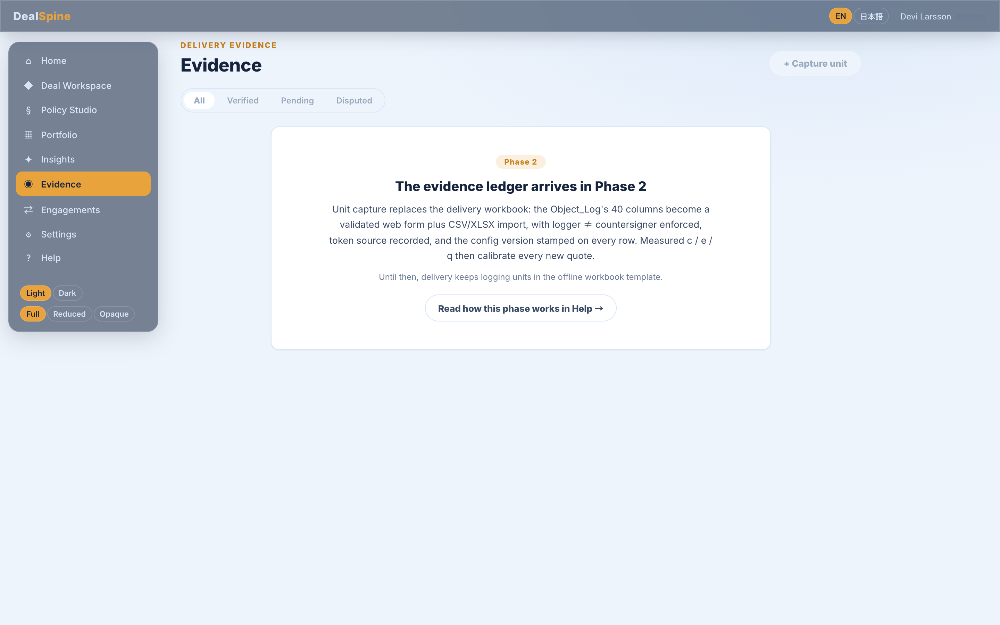

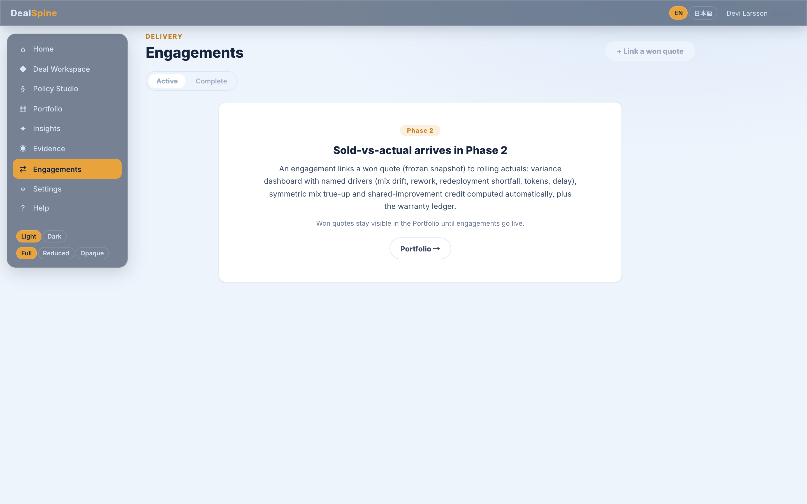

When Phase 2 lands, Devi will:

1. Log each remediated object: AI vs. human vs. review minutes, first‑pass result, rework minutes and cause, tokens in/out, model and config version — with a countersignature (the logger cannot be the sole reporter).
2. Watch **sold‑vs‑actual** variance per engagement, with named drivers (mix drift, rework, token variance).
3. Feed measured coverage / effort / rework back to Priya's parameter sets, so the numbers Sam quotes next time are evidence‑graded.

## Chapter 6 · Lee, Leadership — the portfolio

**Lee watches the whole book.** The **Portfolio** screen is the leadership roll‑up — every quote, its price against its floor, gross profit versus the traditional baseline, the discount distribution against published bands, and the platform reinvestment fund.

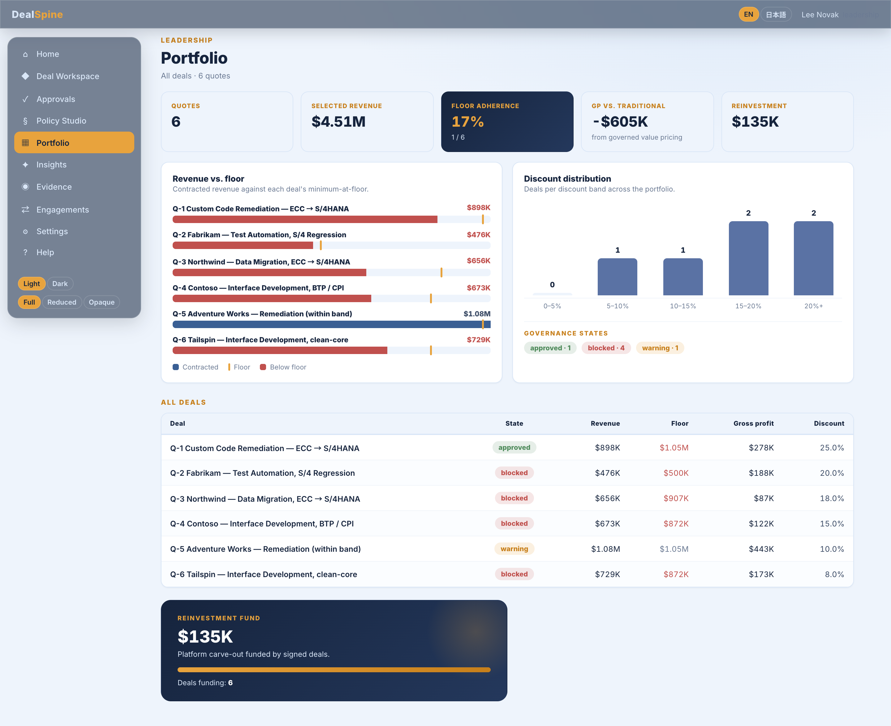

The KPI strip leads with the metrics that matter to a partner: **signed revenue**, **gross profit versus T&M**, **floor adherence** (the share of deals priced at or above their floor), **GP per delivery hour** (the north‑star metric), and **reinvestment funded**. The *Revenue vs. floor* chart shows, deal by deal, whether the contracted price cleared its minimum‑at‑floor — blue clears, red is below floor, the gold tick marks the floor. The reinvestment card tracks the platform‑IP carve‑out accruing across signed deals.

> **Reading the chart.** Deals below floor are exactly the ones the governance engine flagged — leadership sees the discipline working (or not) across the whole portfolio, not one deal at a time.

## Chapter 7 · Bea, the Builder — AI insights and Insight Studio

**Bea makes the app think.** DealSpine is AI‑native: an **Insights** page holds a wall of prompt buttons. Each button is a saved prompt plus a declared data scope and a chosen model. A *builder* like Bea authors a button once; anyone can click it forever.

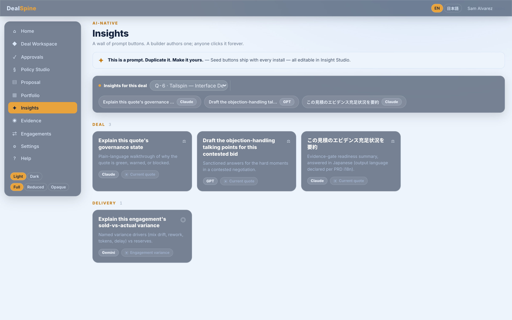

The buttons are grouped by category (Deal, Portfolio, Delivery, Strategy). Each capsule shows its name, a one‑line description, a **provider badge** (this guide uses **Claude**), and a **data‑scope chip** telling you exactly what data the click will package ("uses: current quote", "uses: portfolio summary"). A context run‑bar surfaces the buttons relevant to the deal you're looking at.

To author a new button, Bea clicks **New button** and the **Insight Studio** opens.

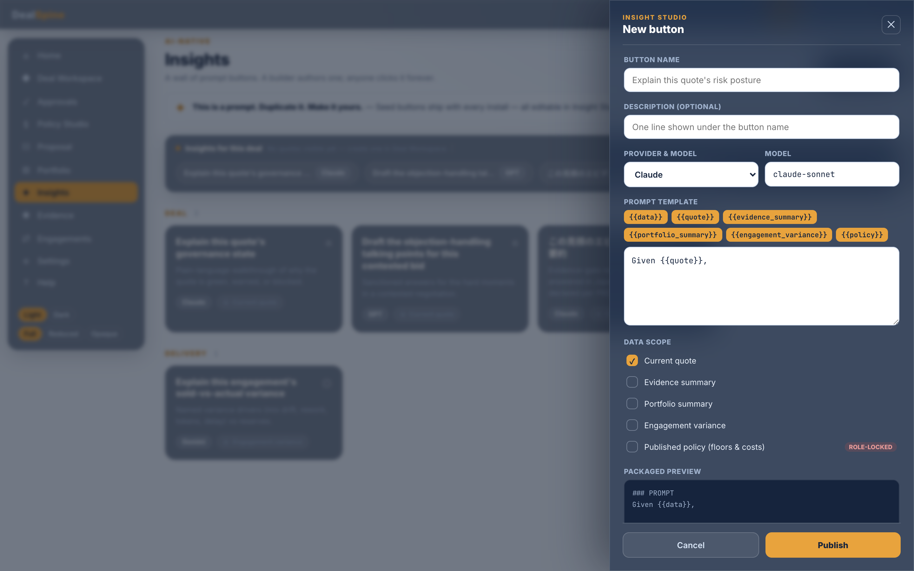

In the Studio she:

1. Names the button and writes a **prompt template**, inserting **typed variables** from the picker — `{{quote}}`, `{{evidence_summary}}`, `{{portfolio_summary}}`, `{{engagement_variance}}`, `{{policy}}` — never free‑typed, so the data binding is always valid.
2. Declares the **data scope** with checkboxes. Note the **Published policy (floors & costs)** scope carries a **ROLE‑LOCKED** chip — a button that packages internal floor or cost data is automatically restricted to roles allowed to see it.
3. Chooses the **provider and model** — here **Claude / claude‑sonnet**.
4. Reviews the **packaged preview** and clicks **Publish**.

The next chapter shows what happens when someone clicks one of Bea's buttons.

---

# Part 3 — AI insights with Claude

## How a prompt button works

When any user clicks an insight button, DealSpine does four things:

1. **Packages** the declared data scope as Markdown — for a deal button, the canonical Markdown rendering of the quote (baseline, AI economics, scenario KPIs, the full gate table, the governance verdict).
2. **Sends** that package with the button's prompt to the selected model (Claude, in this book) using the admin‑stored API key.
3. **Streams** the answer back and renders it as formatted Markdown on a solid result card.
4. **Logs** the run — who clicked, which button, which data scope, which model — and offers a **"What was sent"** disclosure so the exact package is auditable.

Because the caller's data‑access rights always apply, a button whose scope includes floor or cost data will only run for a role permitted to see it.

## The offline fallback (what the pilot shows today)

The pilot ships **without live API keys**, so clicking a Claude button produces a transparent, deterministic **offline analysis** computed locally from the packaged data — the card is clearly labelled *"Claude → Offline mock · fell back to offline mock."* This keeps the app fully functional with no keys and never pretends a real model ran when it didn't.

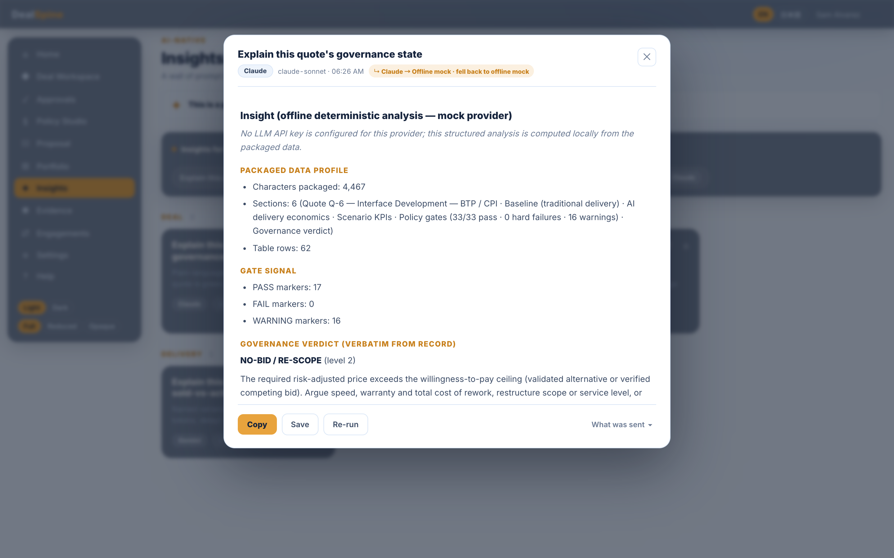

An admin adds real provider keys in **Settings**; from then on the same button calls Claude for real.

## Sample Claude insights

Here is what three of Bea's buttons return when a live Claude key *is* configured — authored here to illustrate the voice and usefulness of a real response on our case‑example quote.

---

### Button: "Explain this quote's governance state" · Claude

> **Governance verdict: BLOCKED — route to the deal desk**
> **Q‑1 · Custom Code Remediation — ECC → S/4HANA**
>
> This quote is blocked because the **25% customer discount sits above the risk‑adjusted maximum of 12.5%**. The deck's naive floor of 32.5% only protects yesterday's gross‑profit dollars; once rework, warranty and evidence‑uncertainty reserves are loaded, the honest floor is far tighter.
>
> **What's driving it**
>
> | Metric | Value | Policy |
> |---|---:|---|
> | Customer discount (d) | 25.0% | at the 25% opening band |
> | Naive breakeven floor (d\*) | 32.5% | reference only |
> | Risk‑adjusted max discount | 12.5% | **hard floor — exceeded** |
> | Gross margin | 31.0% | ≥ minimum |
>
> **What unblocks it, in order of leverage**
> 1. **Bring the discount toward 12.5%** — at 25% the deal is past the risk‑adjusted floor; nothing else will clear it while the discount stays there.
> 2. **Restructure to the tier rate card** ($120 / $260 / $520) rather than a blanket 25% off, so the complex tail carries its own cost.
> 3. **Grade up the evidence** — several gates are warnings because c/e/q are preset assumptions, not measured pilot data; validated evidence and a recorded customer anchor tighten the case for a deal‑desk exception.
> 4. If the customer's alternative is genuinely below the floor, this is a **re‑scope or no‑bid**, not a discount to chase.
>
> Do not tune the delivery assumptions (coverage, effort) to make the number pass — that is the one move the governance rule explicitly forbids.

---

### Button: "Where is this deal below policy?" · Claude

> **Gate review — 1 hard failure, 16 warnings (33 gates pass their pass/fail check)**
>
> **Hard failure (blocks the quote):**
> - *Discount within risk‑adjusted floor* — the selected 25% exceeds the 12.5% risk‑adjusted maximum. This alone routes the deal to the desk.
>
> **Warnings worth clearing before you present (most impactful first):**
> - *Evidence grade is "preset assumption"* — the c/e/q figures are case‑example defaults, not measured pilot data. Grade them up as soon as the first engagement's actuals land.
> - *Anchor confidence unvalidated* — record the customer's alternative (incumbent quote, offshore benchmark, or internal‑team cost) with a source and date.
> - *Class‑mix tolerance not yet agreed* — confirm the ±10% mix clause in the contract so the tier true‑up is enforceable.
>
> **Net:** the deal is economically viable but *not at 25%*. Bring it to the desk with a plan to reach 12–15% via tier restructuring, or with a documented customer alternative that justifies an exception.

---

### Button: "Draft objection‑handling talking points" · Claude

> **If procurement says "your margin looks high, cut the price":**
> - "The price is anchored to *your* validated alternative, not our internal cost. You're paying for a fixed, warranty‑backed outcome — not our hours."
> - "The rework warranty (3 months, capped at 20% of fees) means quality risk stays with us. A cheaper time‑and‑materials bid puts that risk back on you."
> - "You finish in ~5.3 months instead of ~11.3 — the earlier go‑live is worth more than the discount you're asking for."
>
> **If a rival undercuts on unit price:**
> - "Ask them for a *fixed* price with a funded warranty and a class‑mix true‑up. Ours holds within a ±10% mix shift, symmetrically — theirs is an open‑ended T&M estimate."
> - "Our price is calibrated on measured delivery evidence. Cost‑plus pricing removes the vendor's incentive to get faster; ours rewards it."
>
> Keep the floor confidential. Negotiate on the customer's alternative and the tier rate card — never reveal the internal floor number.

---

Every one of these is generated from the *same* Markdown package the "What was sent" disclosure shows, so a reviewer can always check the model's inputs.

---

# Part 4 — Reference

## Who can see and do what (the access matrix)

Every screen and action is gated by role. This is the enforced matrix (server‑side on every API call, not just hidden in the UI):

| Surface / action | Pricing Owner | Sales | Deal Desk | Delivery | Leadership |
|---|:--:|:--:|:--:|:--:|:--:|
| Offerings, rate cards, bands & floors | **edit + publish** | read | read | read | read |
| Deal Workspace (simulate, save quotes) | edit | **edit (own)** | edit | read | read |
| Contested‑bid entry & evidence | edit | edit | **verify** | — | read |
| Approvals & overrides | read | request | **decide** | — | read |
| Proposal generation | yes | **yes** | yes | — | — |
| Evidence log (unit records) | read | read | read | **create + countersign** | read |
| Portfolio & analytics | read | own | read | read | **read** |
| Insights (run buttons) | yes | yes | yes | yes | yes |
| Insight Studio (author buttons) | yes | builder‑flag only | — | — | — |
| Provider keys & user admin | **yes** | — | — | — | — |

Two guarantees are tested in the build and can never regress: **no internal cost / margin / floor figure appears on any customer‑facing output**, and **a quote's author is never its sole approver.**

## The engine, in numbers

The pricing engine is a faithful port of the framework calculator and reproduces the reference case exactly:

| Quantity | Value |
|---|---:|
| Traditional revenue (U × h × Rb) | **$1,197,000** |
| Base AI cost of delivery | ≈ **$392,446** |
| Naive breakeven discount d\* | ≈ **32.5%** |
| Risk‑adjusted maximum discount | ≈ **12.5%** |
| Published tier prices (Simple / Medium / Complex) | **$120 / $260 / $520** |
| Default governance state | **BLOCKED** |

The server always re‑runs the engine and ignores any price the browser sends, so the stored governance state is authoritative.

## Glossary

| Symbol | Meaning |
|---|---|
| **U** | Units of work in scope (here, 3,600 objects) |
| **h** | Traditional hours per unit (3.5) |
| **Rb** | Blended bill rate ($95/h) |
| **Rc** | Loaded delivery cost rate ($62/h) |
| **c** | AI coverage — share of units AI can handle (85%) |
| **e** | Effort reduction on a covered unit (70%) |
| **q** | Human QA add‑back, as a share of hours saved (10%) |
| **t** | AI token cost per covered unit (≈ $1.50) |
| **P** | Platform & tooling cost per engagement ($25,000) |
| **d** | Customer discount versus the traditional / validated‑alternative price |
| **d\*** | Maximum discount before the AI deal earns less than the traditional one; the *naive* floor. DealSpine governs on the tighter **risk‑adjusted** maximum. |

## Settings and Help

The **Settings / Admin** screen (Pricing Owner only) manages users and roles, the builder flag, the LLM provider keys (write‑only — keys are never returned to the client), the read‑only access‑matrix view, and language / theme / glass defaults.

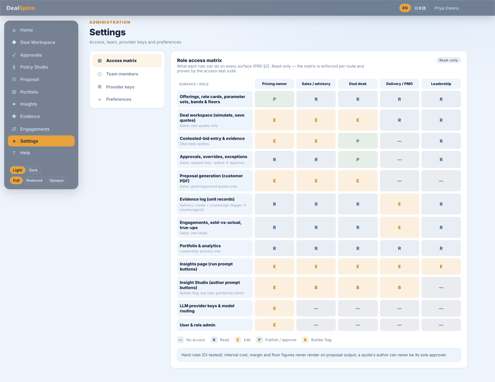

The **Help** academy carries the concepts in this guide as searchable articles, including the variables glossary, the worked example, and the onsite‑Japan / offshore delivery scenario.

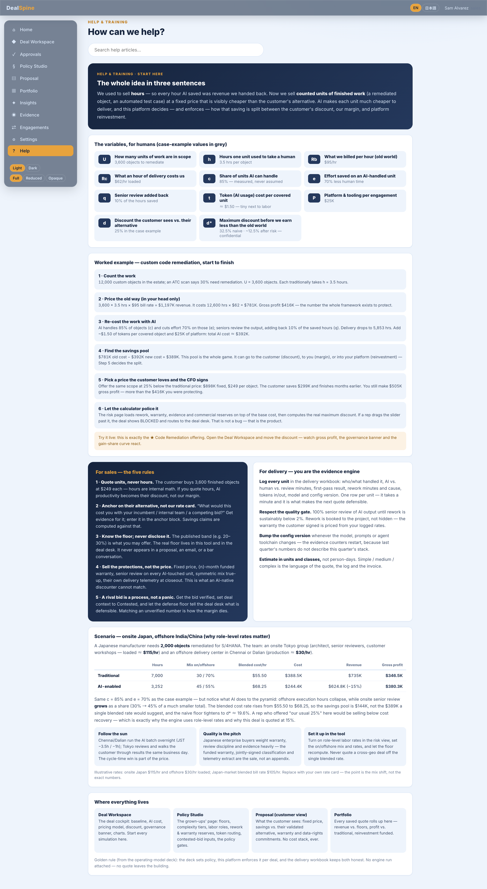

---

# Appendix — What comes next

- **Japanese screens.** This edition covers the English UI. The interface, proposals and this guide localize to Japanese next; the platform already formats dates, numbers and currency per locale and renders customer proposals in the customer's language.
- **Phase 2 — the evidence loop.** Evidence capture and sold‑vs‑actual (Chapter 5) move from placeholder to full function: per‑unit logging, variance dashboards, and automatic recalibration of the parameters Sam quotes with.
- **Phase 3 — compounding IP.** An asset registry for accelerators and prompt packs (each with a measured uplift), a risk‑and‑mitigation playbook, and — the end state — the accumulated best practice served to AI agents through a read‑only knowledge interface, under the same role‑based access as human users.

*The deck sets policy. DealSpine enforces it. The evidence keeps both honest.*
